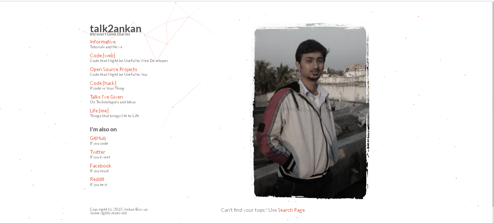
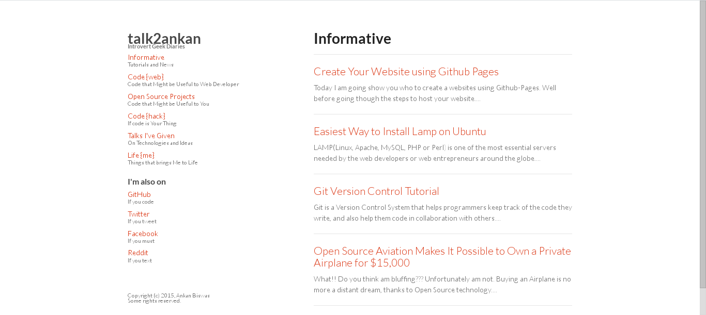

This is the data for my personal website
========================================

This is the copycat, modified version of atmos.org and collection of my older blog posts that I had in 2013 and newly what i add. All of my posts on blog.ankanbiswas.in.

It is automatically transformed by Jekyll_ into a static site whenever I push this repository to GitHub.

Thanks to Corey_, Dhrubajyoti_ and Dan_ for their awesome work which i followed as references:

* http://www.atmos.org/
* http://dhrubajyoti-das.github.io/
* http://danhixon.github.io/

.. _Jekyll: http://jekyllrb.com
.. _Corey: http://www.atmos.org/
.. _Dhrubajyoti: https://github.com/dhrubajyoti-das
.. _Dan: https://github.com/danhixon

Snapshots - Desktop
---------------------------------------

License
=======
The following directories and their contents are Copyright Ankan Biswas. You may not reuse anything therein without my permission:

*   _posts/
*   images/

All other directories and files are MIT Licensed.
